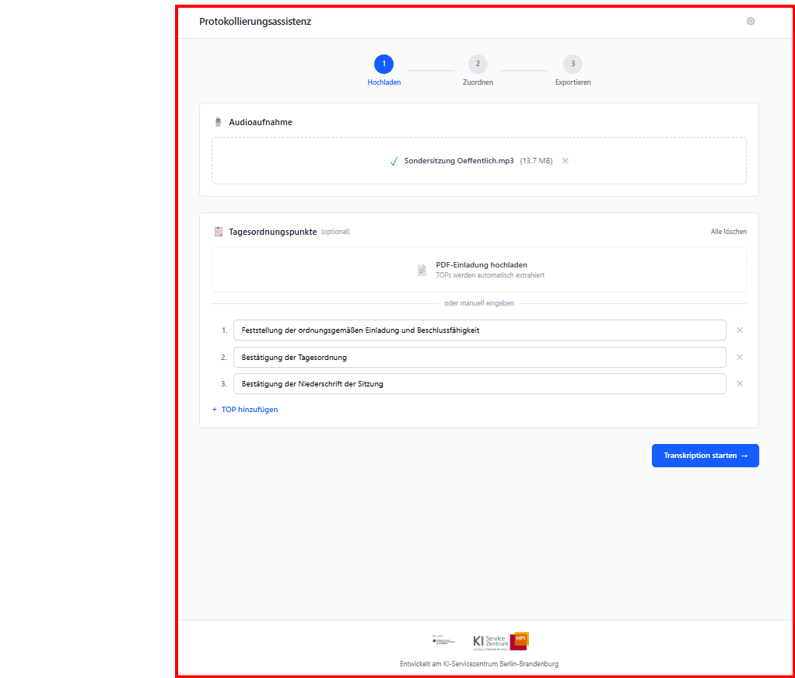
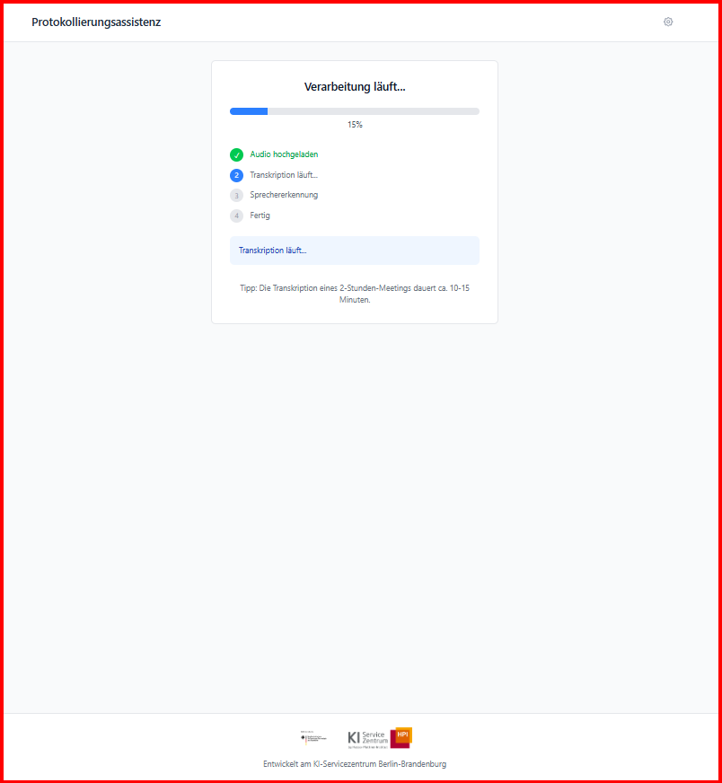
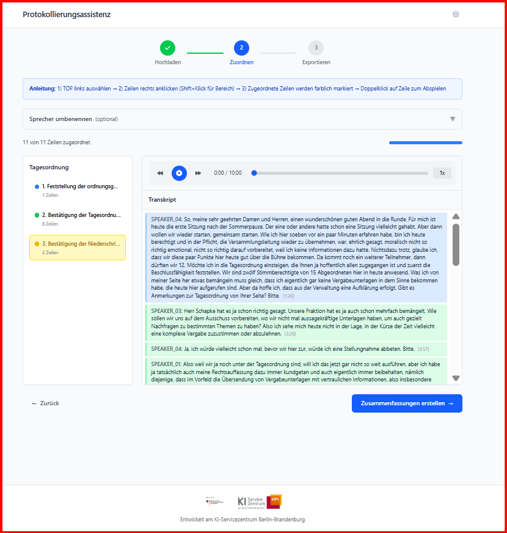
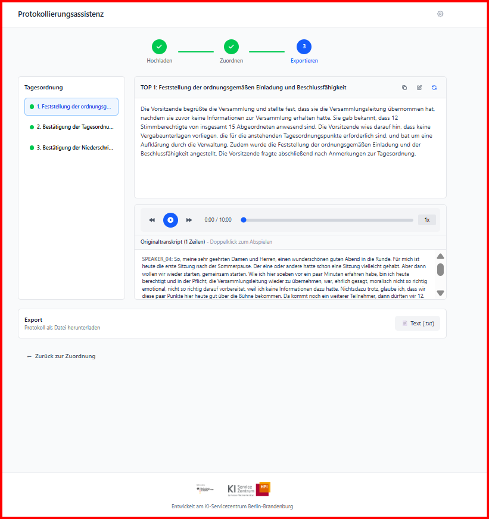

# Protokollierungsassistenz

Automatic transcription and meeting minutes generation from audio recordings of German municipal meetings.

Automatische Transkription und Protokollerstellung aus Audioaufnahmen von deutschen Kommunalsitzungen.

### Screenshots

| Upload | Processing |
|:---:|:---:|
|  |  |
| **Assign segments to agenda items** | **Export meeting minutes** |
|  |  |

---

## System Requirements / Systemanforderungen

| Requirement | Minimum | Recommended |
|-------------|---------|-------------|
| **Disk Space** | 25 GB | 40 GB |
| **RAM** | 8 GB | 16 GB |
| **Internet** | Required for setup | Required for setup |
| **Operating System** | Windows 10/11, macOS 11+, Linux | - |

### Optional: NVIDIA GPU (Windows/Linux only)

If you have an NVIDIA graphics card, the application can transcribe audio much faster. macOS users will use CPU mode (still works, just much slower).

Wenn Sie eine NVIDIA-Grafikkarte haben, kann die Anwendung Audio viel schneller transkribieren. macOS-Benutzer verwenden den CPU-Modus (funktioniert trotzdem, nur viel langsamer).

---

## Installation

### Step 1: Download the Application

Download the application from GitHub:

Laden Sie die Anwendung von GitHub herunter:

1. Go to: **https://github.com/aihpi/pilotproject-protokollierungsassistenz**
2. Click the green **"Code"** button
3. Click **"Download ZIP"**
4. Save the file to your computer (e.g., Downloads folder)
5. **Extract the ZIP file:**
   - **Windows:** Right-click the ZIP file → "Extract All..." → Choose a location (e.g., Desktop or Documents)
   - **macOS:** Double-click the ZIP file to extract it

You should now have a folder called `protokollierungsassistenz-main` (or similar).

Sie sollten jetzt einen Ordner namens `protokollierungsassistenz-main` (oder ähnlich) haben.

---

### Step 2: Install Docker Desktop

Docker is required to run the application. Download and install Docker Desktop:

Docker wird benötigt, um die Anwendung auszuführen. Laden Sie Docker Desktop herunter und installieren Sie es:

| Operating System | Download Link |
|------------------|---------------|
| **Windows** | [Download Docker Desktop for Windows](https://docs.docker.com/desktop/install/windows-install/) |
| **macOS** | [Download Docker Desktop for Mac](https://docs.docker.com/desktop/install/mac-install/) |
| **Linux** | [Download Docker Desktop for Linux](https://docs.docker.com/desktop/install/linux-install/) |

After installation, **start Docker Desktop** and wait until it shows "Docker Desktop is running".

Nach der Installation **starten Sie Docker Desktop** und warten Sie, bis "Docker Desktop is running" angezeigt wird.

---

### Step 3: Run the Setup Script

#### Windows

1. Open the folder where you downloaded/extracted the application
2. Find the file **`setup.ps1`**
3. **Right-click** on it and select **"Run with PowerShell"**
4. Follow the on-screen instructions

If you see a security warning, click "Run anyway" or "More info" → "Run anyway".

#### macOS / Linux

1. Open **Terminal** (macOS: Applications → Utilities → Terminal)
2. Navigate to the application folder:
   ```bash
   cd /path/to/protokollierungsassistenz
   ```
3. Run the setup script:
   ```bash
   ./setup.sh
   ```
4. Follow the on-screen instructions

---

### Step 4: Wait for Download

The setup will download the application images (~6 GB) and AI models (~5 GB). This may take **5-15 minutes** depending on your internet speed.

Das Setup lädt die Anwendungsimages (~6 GB) und KI-Modelle (~5 GB) herunter. Dies kann je nach Internetgeschwindigkeit **5-15 Minuten** dauern.

You will see progress messages. When complete, your browser will open automatically.

Sie sehen Fortschrittsmeldungen. Nach Abschluss öffnet sich Ihr Browser automatisch.

---

### Step 5: Start Using the Application

Once setup is complete, the application is available at:

Nach Abschluss des Setups ist die Anwendung verfügbar unter:

**http://localhost:3000**

---

## Daily Usage / Tägliche Nutzung

### Starting the Application

If you restart your computer, you need to start the application again:

Wenn Sie Ihren Computer neu starten, müssen Sie die Anwendung erneut starten:

1. **Start Docker Desktop** (if not running)
2. Run the setup script:
   - **Windows:** Right-click `setup.ps1` → "Run with PowerShell"
   - **macOS/Linux:** Open Terminal in the application folder and run `./setup.sh`

The script will check if the application is already running and open your browser automatically.

Das Skript prüft, ob die Anwendung bereits läuft und öffnet automatisch Ihren Browser.

### Stopping the Application

To stop the application and free up resources:

Um die Anwendung zu stoppen und Ressourcen freizugeben:

- **Windows:** `.\setup.ps1 stop`
- **macOS/Linux:** `./setup.sh stop`

### Other Commands / Weitere Befehle

| Command | Description |
|---------|-------------|
| `./setup.sh status` | Check if services are running / Status der Dienste prüfen |
| `./setup.sh logs` | View live logs / Live-Logs anzeigen |
| `./setup.sh restart` | Restart the application / Anwendung neu starten |

---

## Troubleshooting / Fehlerbehebung

### "Docker is not running"

Make sure Docker Desktop is started and shows "Running" status.

Stellen Sie sicher, dass Docker Desktop gestartet ist und den Status "Running" zeigt.

### "Not enough disk space"

Free up at least 25 GB of disk space before running setup.

Geben Sie mindestens 25 GB Speicherplatz frei, bevor Sie das Setup ausführen.

### Application is slow

- Transcription on CPU is slower than GPU (this is normal)
- First transcription may take longer due to model loading
- Ensure Docker Desktop has enough memory allocated (8 GB+)

### View Logs

To see what's happening:

```bash
docker compose logs -f
```

Press `Ctrl+C` to stop viewing logs.

### Complete Reset

If something goes wrong and you want to start fresh:

```bash
docker compose down -v
./setup.sh  # or .\setup.ps1 on Windows
```

---

## Nutzungsstatistiken / Usage Statistics

Diese Anwendung sendet anonyme Nutzungsstatistiken, um uns bei der Weiterentwicklung zu helfen.

This application sends anonymous usage statistics to help us improve the tool.

### Erfasste Daten / Data Collected

- Audiodauer und Verarbeitungszeiten / Audio duration and processing times
- Hardware-Informationen (GPU-Typ, Speicher) / Hardware info (GPU type, memory)
- Verwendete Modelle (Whisper, LLM) / Models used (Whisper, LLM)
- Anzahl Tagesordnungspunkte / Number of agenda items
- Textlängen (Transkript, Protokoll) / Text lengths (transcript, protocol)
- Verwendeter System-Prompt / System prompt used

### Nicht erfasste Daten / Data NOT Collected

- Inhalte von Transkripten oder Protokollen / Transcript or protocol content
- Namen oder persönliche Daten / Names or personal data
- Audio-Dateien / Audio files

---

## GPU Mode (Optional, Windows/Linux)

If you have an NVIDIA GPU and want faster transcription:

1. Install [NVIDIA Container Toolkit](https://docs.nvidia.com/datacenter/cloud-native/container-toolkit/install-guide.html)
2. Run the setup script - it will detect your GPU automatically
3. Choose "Yes" when asked about GPU mode

macOS does not support NVIDIA GPUs.

---

## Reporting Issues & Feedback

Found a bug? Have a feature request? We'd love to hear from you!

Haben Sie einen Fehler gefunden? Haben Sie einen Funktionswunsch? Wir freuen uns über Ihr Feedback!

### How to Report an Issue

1. Go to: **https://github.com/aihpi/pilotproject-protokollierungsassistenz/issues**
2. Click **"New Issue"**
3. Include the following information:
   - Your operating system (Windows/macOS/Linux)
   - What you were trying to do
   - What happened (error message, screenshot if possible)
   - Steps to reproduce the problem

### Feature Requests

Have an idea for improving the application? Create an issue and describe:
- What feature you'd like to see
- Why it would be helpful for your work

---

## For Developers

<details>
<summary>Click to expand developer documentation</summary>

### Overview

This application provides a web-based workflow for generating meeting minutes (Sitzungsprotokolle) from audio recordings:

1. **Upload** - Upload audio recording and enter agenda items (Tagesordnungspunkte/TOPs)
2. **Transcribe** - Automatic transcription with speaker diarization using WhisperX + PyAnnote
3. **Assign** - Manually assign transcript segments to each TOP
4. **Summarize** - Generate summaries per TOP using an LLM (Qwen3 8B via Ollama)
5. **Export** - Download the final meeting minutes

### Project Structure

```
protokollierungsassistenz/
├── app/
│   ├── frontend/          # React + TypeScript web application
│   └── backend/           # FastAPI Python backend
├── scripts/               # Setup and utility scripts
├── .github/workflows/     # CI/CD for building Docker images
└── docker-compose.yml     # Production deployment
```

### Pre-built Images

Docker images are automatically built and published to GitHub Container Registry:

- `ghcr.io/aihpi/pilotproject-protokollierungsassistenz/frontend:latest`
- `ghcr.io/aihpi/pilotproject-protokollierungsassistenz/backend:cpu-latest`
- `ghcr.io/aihpi/pilotproject-protokollierungsassistenz/backend:gpu-latest`

These images include all ML models pre-bundled, so no HuggingFace token is required for end users.

### Development Setup

#### 1. Ollama (for summarization)

```bash
# macOS
brew install ollama

# Start Ollama server
ollama serve

# Pull the model (in another terminal)
ollama pull qwen3:8b
```

#### 2. Backend

```bash
cd app/backend

# Install dependencies with uv
uv sync

# Set environment variables
export HF_TOKEN=your_huggingface_token

# Run development server
uv run uvicorn main:app --port 8010
```

The backend runs on `http://localhost:8010`.

#### 3. Frontend

```bash
cd app/frontend

# Install dependencies
npm install

# Run development server
npm run dev
```

The frontend runs on `http://localhost:5173`.

### Building Docker Images Locally

To build images locally (requires HuggingFace token):

```bash
# CPU image
docker build --build-arg HF_TOKEN=$HF_TOKEN -t backend:cpu ./app/backend

# GPU image
docker build -f Dockerfile.gpu --build-arg HF_TOKEN=$HF_TOKEN -t backend:gpu ./app/backend
```

### Environment Variables

| Variable             | Description                                         | Default                     |
| -------------------- | --------------------------------------------------- | --------------------------- |
| `HF_TOKEN`           | HuggingFace token (only for local builds)           | -                           |
| `WHISPER_MODEL`      | Whisper model size                                  | `large-v2`                  |
| `WHISPER_DEVICE`     | Device for inference (`cuda`, `cpu`, `auto`)        | `auto`                      |
| `WHISPER_BATCH_SIZE` | Batch size for transcription                        | `16`                        |
| `WHISPER_LANGUAGE`   | Language code                                       | `de`                        |
| `LLM_BASE_URL`       | Ollama API endpoint                                 | `http://localhost:11434/v1` |
| `LLM_MODEL`          | Model name for summarization                        | `qwen3:8b`                  |
| `TELEMETRY_WEBHOOK_URL` | Google Apps Script webhook URL for telemetry     | (empty, disabled)           |

### API Endpoints

| Endpoint                         | Method | Description                          |
| -------------------------------- | ------ | ------------------------------------ |
| `/health`                        | GET    | Health check                         |
| `/api/transcribe`                | POST   | Upload audio and start transcription |
| `/api/transcribe/{job_id}`       | GET    | Get transcription job status         |
| `/api/audio/{job_id}`            | GET    | Stream audio file                    |
| `/api/summarize`                 | POST   | Generate summary for a TOP segment   |
| `/api/extract-tops`              | POST   | Extract TOPs from PDF                |
| `/api/telemetry/session-complete`| POST   | Report session completion telemetry  |

### Technology Stack

**Frontend:**
- React 19 with TypeScript
- Vite
- Tailwind CSS

**Backend:**
- FastAPI
- WhisperX (speech-to-text with word-level timestamps)
- PyAnnote (speaker diarization)
- Ollama with Qwen3 8B (summarization)

</details>

---

## Acknowledgements

<a href="http://hpi.de/kisz">
  
</a>

The [AI Service Centre Berlin Brandenburg](http://hpi.de/kisz) is funded by the [Federal Ministry of Research, Technology and Space](https://www.bmbf.de/) under the funding code 01IS22092.
